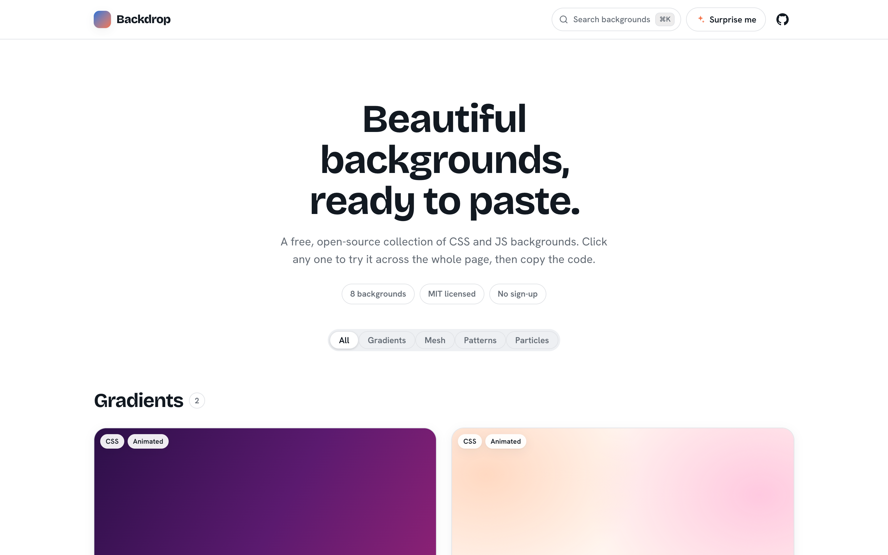

# Backdrop

**Copy-paste UI backgrounds.** A free, open-source gallery of CSS and JS/canvas backgrounds for landing pages, portfolios, and apps. Preview any background across the *entire site* with one click, then copy the code and ship it.



## Why Backdrop

- **Feel it at full scale.** Click any card and the background applies to the whole page — you experience it as a real environment, not a thumbnail. Press `Esc` (or the floating bar) to come back.
- **Copy in seconds.** Every background ships as a self-contained, paste-ready snippet — no imports, no setup.
- **Accessible by default.** Every animated background has a `prefers-reduced-motion` fallback, and the UI auto-flips for contrast when a dark background is applied.
- **Built to be contributed to.** A background is one file plus one import line. Your name and GitHub link appear on the card.

## Run it locally

```bash
git clone <repo-url>
cd backdrop
npm install
npm run dev
```

Open [http://localhost:3000](http://localhost:3000).

## Use a background in your project

1. Browse the gallery — hover a card to play its animation.
2. Click **Preview** (or the card) to apply it to the whole site and feel it at scale.
3. Click **Copy** (or open the code dialog) to grab the snippet.
4. Paste it into your project:
   - **CSS backgrounds** are a class + keyframes — drop them in your stylesheet and add the class to any container.
   - **JS/canvas backgrounds** are a self-contained component — paste the file in and render it inside a `position: relative` container.

Every snippet is self-contained: no dependencies on this repo.

## Tech

Next.js (App Router) · React · TypeScript · Tailwind CSS v4 (OKLCH design tokens) · shadcn/ui primitives.

## Contribute a background

Adding one is a single file plus one import line — a great first open-source PR. See [CONTRIBUTING.md](CONTRIBUTING.md) for the 10-minute walkthrough.

## License

[MIT](LICENSE) — free to use in personal and commercial projects.
